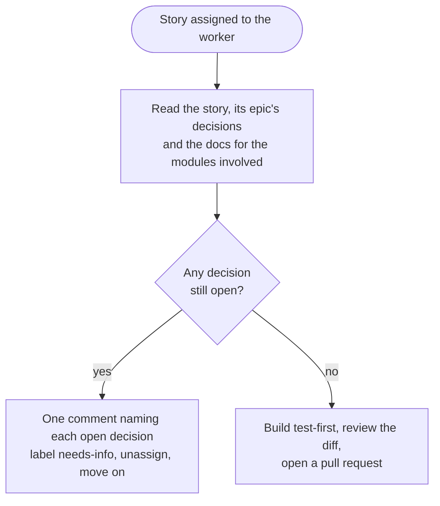
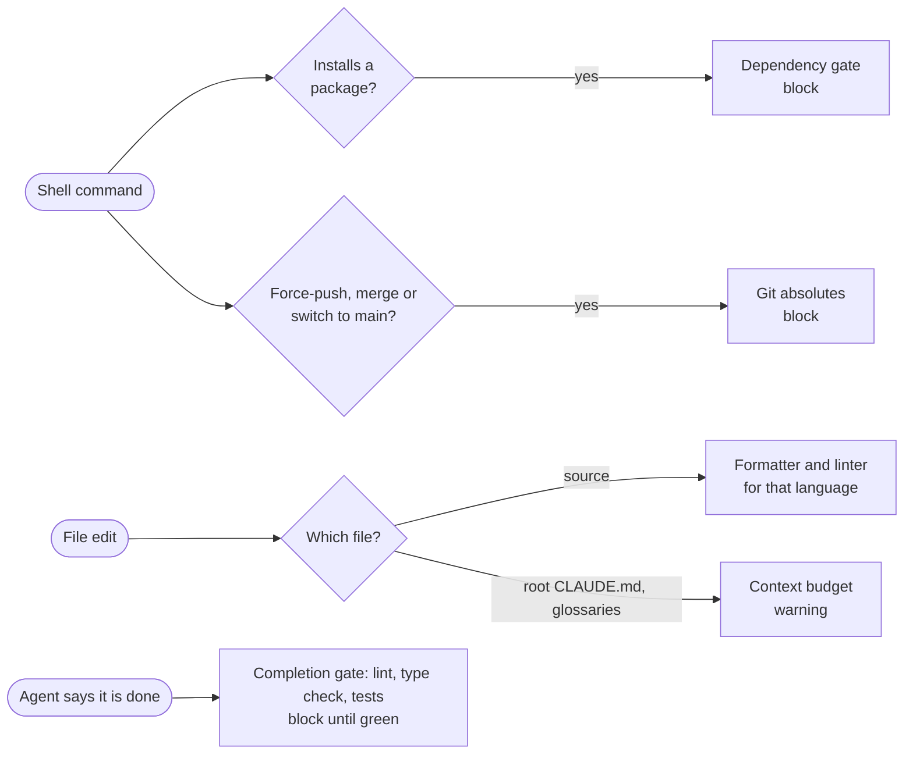
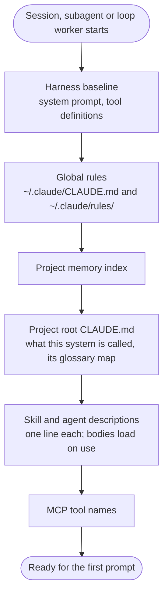
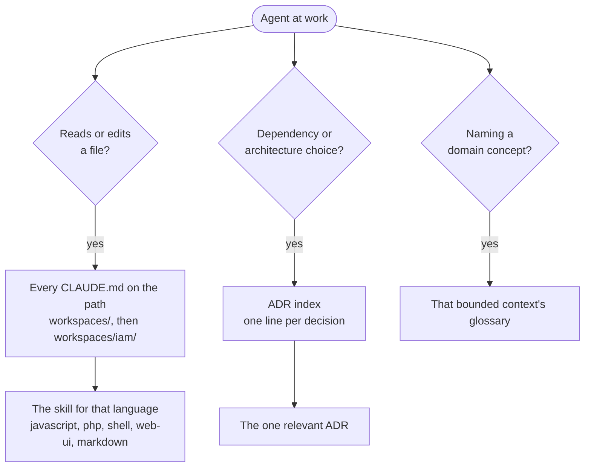

# Dev0 <!-- omit in toc -->

_Spend your judgement before the code exists._

## Table of Contents <!-- omit in toc -->

- [1. Dev0 in Brief](#1-dev0-in-brief)
- [2. The Zero in Dev0](#2-the-zero-in-dev0)
  - [2.1. Core Tenets](#21-core-tenets)
  - [2.2. The Strategic Decision Matrix: Examples in Practice](#22-the-strategic-decision-matrix-examples-in-practice)
- [3. Why Agents Do Not Write Dev0 Code](#3-why-agents-do-not-write-dev0-code)
- [4. The Boundary](#4-the-boundary)
  - [4.1. A Blueprint Is Not Acceptance Criteria](#41-a-blueprint-is-not-acceptance-criteria)
  - [4.2. The Worker Is Allowed to Refuse](#42-the-worker-is-allowed-to-refuse)
- [5. Instruct, Justify, Enforce](#5-instruct-justify-enforce)
  - [5.1. Rules That Can Be Counted](#51-rules-that-can-be-counted)
  - [5.2. Recording What You Said No To](#52-recording-what-you-said-no-to)
- [6. The Right Model in the Right Seat](#6-the-right-model-in-the-right-seat)
- [7. Context Is a Budget](#7-context-is-a-budget)
- [8. Autonomy Is Earned](#8-autonomy-is-earned)
- [9. So, Are We Being Replaced?](#9-so-are-we-being-replaced)
- [10. What Dev0 Is, Honestly](#10-what-dev0-is-honestly)
- [11. Who Reads This](#11-who-reads-this)

## 1. Dev0 in Brief

I have been building software for 40 years. Dev0 is my attempt to name how I do it, and then to rebuild my agentic workflow so that the machine does it that way too.

- **Dev0 is Zero-Based Development.** Start from zero assumptions, zero abstractions and zero dependencies, and make every addition earn its place against the whole system. The default question flips from "why shouldn't we add this?" to "does this earn the right to exist?" It applies to any stack; the examples here lean towards the web because that is where most of my work is. See [The Zero in Dev0](#2-the-zero-in-dev0).
- **Coding agents write median code.** Trained on a framework-first, defensive, dependency-happy corpus, they produce plausible code an experienced engineer then strips by hand, file by file. See [Why Agents Do Not Write Dev0 Code](#3-why-agents-do-not-write-dev0-code).
- **The fix is to spend judgement before generation, not after.** Once, on prose, answering questions. A blueprint constrains every file an agent touches; a post-hoc edit fixes one. See [Why Agents Do Not Write Dev0 Code](#3-why-agents-do-not-write-dev0-code).
- **One boundary divides the work.** The architect owns the blueprint and the architecture; agents own construction and verification; the signed blueprint is the line between them. See [The Boundary](#4-the-boundary).
- **Everything sits in one of three tiers.** Rules instruct, decision records justify, hooks and lint enforce. Anything that can be mechanised is, because a hook does not decay. See [Instruct, Justify, Enforce](#5-instruct-justify-enforce).
- **Models are routed by whether the decisions are closed.** Judgement gets the strongest model; building against a signed blueprint gets a faster one, because extrapolation there is a defect. See [The Right Model in the Right Seat](#6-the-right-model-in-the-right-seat).
- **Context is a budget, and knowledge lives beside the code it describes.** See [Context Is a Budget](#7-context-is-a-budget).
- **Autonomy is earned and counted.** Agents open pull requests; they never merge. See [Autonomy Is Earned](#8-autonomy-is-earned).
- **The senior engineer's job moves upstream, not away.** Boundaries, saying no, closing decisions and taste get more valuable as construction gets cheaper. See [So, Are We Being Replaced?](#9-so-are-we-being-replaced).

## 2. The Zero in Dev0

Dev0 (Zero-Based Development) is an architectural and engineering philosophy that rejects default industry bloat in favour of intentionality, ruthless simplicity, and structural clarity. The name borrows from zero-based budgeting, where a department does not start from last year's budget plus 5%; it starts from nothing, and every line item has to justify itself.

Most of us build software the opposite way. `npx create-next-app`, `laravel new`, `express-generator`. We start from a framework, a folder structure, a state library, an ORM, a validation library and a few hundred transitive packages, and then we write our actual problem into the gaps.

Dev0 applies a zero-based mindset across the entire software lifecycle instead: start from an absolute baseline of zero assumptions, zero abstractions, and zero dependencies, requiring every single addition to justify its existence against the whole system. That is not "code golf", and it is not dogmatic asceticism. It shifts the default developer posture from "Why shouldn't we add this?" to "Does this component earn the right to exist in our system?" It replaces passive accretion with active, conscious architecture.

### 2.1. Core Tenets

- **Holistic-First Systems Thinking:** Architecture begins at the perimeter. Dev0 starts with a wide-angle view of the problem space to delineate bounded contexts and business domains before writing a line of code. It deliberately zooms from macro to micro while keeping the overall system topology in focus. If you come from microservices this will feel familiar, except the boundaries are drawn by business meaning rather than by deployment units: a bounded context is an area of the business where a word like "Account" means one precise thing. The same instinct favours intent-based, CQRS-style APIs, where commands that change state ("register producer") are modelled separately from queries that read it, over a generic REST resource that tries to be both.
- **C4 Model Alignment:** Dev0 leverages the [C4 model](https://c4model.com/) (Context, Containers, Components, Code) because it reflects this exact zooming mechanism. It ensures developers never lose the forest for the trees, avoiding the trap of hyper-optimising a leaf component at the expense of container-level simplicity.
- **Strategic Dependency Evaluation:** Dev0 does not forbid third-party dependencies; it forbids unexamined ones. When evaluating an external package, the architect must weigh its business and functional value against its total footprint.
- **Full Dependency-Tree Accountability:** An architect is responsible not just for the top-level package, but for the entire transitive tree. A 5 KB utility that drags in 40 indirect packages, cyclic dependencies, or heavy build tooling fails the Dev0 standard. You are accountable for everything `npm install` put on disk, not just the line you typed.
- **Respect for the Platform:** The native platform -- standardised browser APIs, the raw runtime, standard protocols, semantic HTML -- is the default framework. Dev0 relies on the platform first before layering abstractions.

### 2.2. The Strategic Decision Matrix: Examples in Practice

Three decisions from Deck0, a Markdown slide-deck engine, make the tenets concrete:

- **The Justified Inclusion:** Markdown parsing. Parsing CommonMark involves extensive specification edge cases, security sanitisation considerations, and complex tokenisation. Using a single, battle-tested, focused library like `marked` is a strategic Dev0 decision: the problem is solved, specialised, and avoids reinventing a massive wheel, while keeping direct and transitive overhead bounded.
- **The Rejected Inclusion:** Pulling in an entire UI component framework or state management library to render a clean slide or toggle a modal. The platform already provides semantic tags, CSS Grid, Scroll Snap, and native DOM APIs that accomplish the task with zero runtime weight.
- **The Semantic Delimiter:** Choosing native `<h1>` tags as presentation slide boundaries rather than inventing custom metadata schemas or parser syntax. The structure of the document is the interface, maintaining compatibility with standard Markdown renderers without adding parser overhead.

## 3. Why Agents Do Not Write Dev0 Code

If you have used a coding agent seriously, you know this moment. The agent finishes. The tests pass. You open the diff and start deleting.

A defensive null check on an argument the type system already guarantees. A `try`/`catch` that logs and rethrows, stripping the stack context on the way. A `utils/` folder holding one function with one caller. A JSDoc block that restates the function name in a full sentence. A constant named `MAX_RETRIES_THREE` set to `3`. And, somewhere in `package.json`, a validation library pulled in to check two fields.

None of it is wrong, exactly. It compiles, it runs, it would pass most code reviews. It just is not the code an experienced engineer would have written, and you spend your afternoon turning it into that code, one file at a time, on every pull request, forever.

A coding agent is trained on the public corpus of software, and the public corpus is overwhelmingly framework-first, defensive, over-abstracted and dependency-happy. Ask for "a small API endpoint" and you get the statistical centre of every tutorial ever written. It is a very good median engineer.

For years my response was to generate, then edit. Dev0 as a _toolkit_ started with one observation:

> I was spending my judgement **after** generation, stripping verbose code out of diffs -- repeatedly, per file. The fix is to spend it **before** generation: once, on prose, answering questions rather than authoring. A blueprint constrains every file the agent touches. A post-hoc edit fixes one.

Everything else in the design is downstream of that sentence.

## 4. The Boundary

The toolkit rests on one line. It is the first thing every agent reads:

> **The architect owns the blueprint and the architecture. Agents own construction and verification. The signed blueprint is the boundary.**

Upstream of the boundary is human-in-the-loop work, and its whole purpose is to sharpen human thinking. An agent grills me about a plan, one question at a time, until the decisions are closed. It helps me model the domain and name things. It drafts a blueprint from our conversation. I sign it.

Downstream of the boundary is away-from-keyboard work, and its purpose is to execute _without interpreting_. The agent builds against the signed blueprint, then verifies against the code rules, the linters, the type checker and the tests.

The part that matters is where the expertise is spent. On the upstream side it is spent on the questions that actually determine quality: what are the boundaries, what are we not building, which dependency do we refuse, what happens at the edge. On the downstream side it is barely spent at all, because those questions have already been answered.

### 4.1. A Blueprint Is Not Acceptance Criteria

This distinction explained most of my bad results with autonomous agents.

Acceptance criteria are a **test oracle**. They tell you whether you are done. They do not tell you what to build. Hand an agent only acceptance criteria and it has to invent the design, and its invention is not yours. It will be plausible, and it will be the median.

| Artefact                | Answers          | Drives              | Author                     |
| ----------------------- | ---------------- | ------------------- | -------------------------- |
| **Blueprint**           | What do I build? | Construction        | Human, with agent grilling |
| **Acceptance criteria** | Is it done?      | Verification, tests | Human                      |

So every story carries a blueprint, and an agent does not pick up a story without one. Assigning the story to the agent _is_ the approval. One deliberate gesture, no status dance.

### 4.2. The Worker Is Allowed to Refuse

Before it writes a test or a line of code, the worker reads the story, its epic's decisions and the docs beside the modules it will touch, and lists the decisions the blueprint leaves open. If there are any, it does not guess. It asks, in one comment naming each missing decision, then hands the story back: labelled `needs-info` and unassigned, so no other worker picks it up half-specified. The answers go into the epic's decisions, not the comment thread, and reassigning the story is the new sign-off.

That sounds like a small feature. It is the most important behavioural change in the loop. Underspecification stops becoming code I have to strip and starts becoming feedback on how I write blueprints. The loop trains the human, not just the other way round.

## 5. Instruct, Justify, Enforce

Anyone who has written a long `CLAUDE.md` or system prompt knows that instructions decay. Early in a session the agent follows them. Forty tool calls later, under pressure to make a test pass, "prefer no new dependencies" becomes "this dependency is clearly justified because...".

Dev0 puts everything in exactly one of three tiers, named by verb:

| Tier                 | Verb     | Example                                              | When it applies                      |
| -------------------- | -------- | ---------------------------------------------------- | ------------------------------------ |
| **Rules**            | Instruct | "Validate at the boundary, then trust."              | Always in context                    |
| **Decision records** | Justify  | "We rejected React for this, and here is why."       | Read when a relevant choice comes up |
| **Hooks and lint**   | Enforce  | A pre-tool hook that refuses `npm install <package>` | On the tool call itself              |

A rule only earns a place in the always-on tier if it beats the model's default _and_ cannot be mechanised. Anything that can be mechanised moves down to enforcement, because a hook does not decay.

The best example is the dependency gate. The rule is **default-deny**: no new dependency, runtime or dev, without the architect's decision, and no agent-side justification is accepted. As prose, that is something a model talks its way past. As a hook that intercepts the install command before it runs, it cannot be argued with. That single hook turns Dev0 from a philosophy into a property of the machine. It also fires regardless of which agent or subagent issued the command, so there is no leakage through delegation.

The same logic gives a completion gate: when the agent says it is finished, lint, type check and tests run whether or not the agent remembered to run them.

Hooks cost no context and cannot be talked past. They fire on the tool call, whichever agent made it:

### 5.1. Rules That Can Be Counted

The rules that do stay in prose are written to be checkable. Two principles make that work.

First, **counted triggers**. "Avoid premature abstraction" is unfalsifiable. "Abstract on the third repetition, not the second" is not; an agent can be told it is wrong. The same shape recurs: a function lives in the file that calls it until a second caller exists; five or more parameters take an options object; a literal gets a name when it is used twice or the name adds meaning. Default to the direct thing, and earn the indirection with a trigger you can count.

Second, **positive phrasing**. "Don't write defensive null checks" puts defensive null checks into context and makes them more likely. "Validate at the boundary, then trust" describes the behaviour you want instead.

### 5.2. Recording What You Said No To

A codebase records what you built. It can never record what you ruled out. An agent that sees no React in the repository cannot tell whether React was rejected or simply has not been added yet, so it proposes React. Every session. Forever.

So Dev0 treats Architecture Decision Records as the precedent ledger, and every cross-project decision must list the rejected alternatives. "Validation library rejected" and "conventional commits rejected" are as load-bearing as anything accepted. Agents reach them through a generated one-line index, and the dependency gate's refusal message points straight at it.

## 6. The Right Model in the Right Seat

A common instinct is "use the smartest model for everything". Dev0 routes models by a different axis: **has the blueprint already closed the decisions?**

| Work                                              | Nature                                    | Who                                 |
| ------------------------------------------------- | ----------------------------------------- | ----------------------------------- |
| Blueprint, architecture, grilling                 | Judgement; extrapolation wanted           | The human, with the strongest model |
| Worker building against a signed blueprint        | Compliance; **extrapolation is a defect** | A faster, cheaper model             |
| Reviewing a diff: "does this look like our code?" | Judgement; requires taste                 | The strongest model                 |
| Diagnosing an opaque bug                          | Open-ended judgement                      | The strongest model                 |

A highly capable model reading more into the problem is exactly what you want while designing, and exactly what you do not want while building against a signed blueprint. So there is deliberately no "senior" worker model. Work that needs senior judgement mid-build routes back to the human, not to a smarter model improvising architecture inside the loop. That improvisation was the failure mode in the first place.

The strongest model does get one construction-adjacent job: a review pass that reads the diff and does the stripping I used to do by hand. It is the only agent that reads this document, because judging whether a dependency or an abstraction earns its place is judgement. Workers get the rules; the reviewer gets the philosophy.

## 7. Context Is a Budget

Every always-on instruction is paid for in every session, and every subagent inherits the full load. An autonomous loop that spawns one worker per story pays it per worker. Context is a budget, and bloat in it has the same cost profile as bloat in a bundle.

This is what every agent pays before it reads the first prompt. The harness baseline is outside my control; everything below it is mine to keep small:

That changed how I think about documentation. On one production platform I measured, half of the entire documentation mass sat in an "explanation" folder, and most of that described a part of the system that had no code of its own. Docs sprawl precisely where nothing owns them. Categorisation schemes tell you _which folder_ a fact belongs in; they never tell you "no, this already lives in the code".

Dev0's answer is an ownership rule: **knowledge lives beside the code it describes.** The directory tree is the information hierarchy. A short root file is always loaded; a file in `workspaces/` loads only when you work in a workspace; a file in `workspaces/iam/lib/` loads only when you touch that library. Depth equals specificity equals laziness of loading. Move the code and the documentation moves with it. If no code claims a piece of knowledge, it is either a decision record or it is dead.

Everything else waits until the work asks for it:

And documentation is written when a story asks for it or a public interface changes. Never speculatively.

## 8. Autonomy Is Earned

The loop's autonomy boundary is narrow on purpose: work in an isolated worktree, branch, push, open a pull request. Never touch `main`, never force-push, **never merge**.

Why not merge on green? Because the dangerous failure is not bad code. CI catches bad code. The dangerous failure is **correct code for a misunderstood ticket**, and no test suite can see that. The pull request is where a human catches it cheaply.

After each PR the loop stops and waits for review. It graduates to running unattended after **ten consecutive PRs merged with no material change**. A countable threshold means you neither flip the switch on a good day nor never flip it at all.

## 9. So, Are We Being Replaced?

This is the question underneath every conversation I have with senior engineers right now, so let me answer it directly.

Agents are already very good at construction, and they will get better. If your value is translating a ticket into code, the ground under you is moving, and pretending otherwise does no one any favours.

But look at where Dev0 spends human expertise, and notice it is everything the agent is structurally bad at:

- **Drawing boundaries.** Which bounded contexts exist, what crosses between them, what "Account" means here.
- **Saying no.** Rejecting the dependency, the framework, the abstraction, the feature. The model is trained on a corpus of things people said yes to.
- **Closing decisions before they become code.** A blueprint that leaves nothing to extrapolate.
- **Recognising correct code for the wrong problem.** The failure no test can see.
- **Taste.** Knowing what your code should look like, well enough to write it down as rules an agent can be checked against.

None of those get cheaper when construction gets cheaper. They get _more_ valuable, because every unit of judgement now fans out across every file an agent writes instead of the files one person can type. An engineer with 20 years of hard-won opinions was previously limited by their own output. Encoded as a blueprint, a set of counted rules, a record of rejections and a handful of hooks, those opinions shape the output of as many workers as you can review.

The engineers most exposed are not the juniors or the seniors. They are the ones who let the agent make the architectural decisions by default. The lucky ones notice, and spend their days editing the median into shape. Many never notice at all. Blinded by the promise of AI, they accept the median as it lands, and their codebases quietly grow into tangled messes, carrying technical debt no one knows is there until it comes due. The first group has a tedious job Dev0 is designed to eliminate. The second has a crisis it is designed to prevent.

## 10. What Dev0 Is, Honestly

A few caveats, because a framework without them is marketing.

- **It is being built now**, in phases, and dogfooded on itself: the toolkit's own stories are the first work the autonomous loop will run against. Some of what this document describes -- the hooks, the loop, the review pass -- is design, not yet code.
- **It is harness-specific.** The cascade, hooks and subagent behaviour lean on Claude Code's mechanisms, and I have accepted that trade-off in a recorded decision rather than building an abstraction layer across agents (which would itself fail the Dev0 test).
- **It is opinionated to one practitioner.** The code rules are literally derived from the edits I make to agent output. Yours will differ. The structure -- judgement upstream, compliance downstream, enforcement in hooks, rejections on the record -- is the part I expect to transfer.
- **It still runs on legacy code.** A large PHP monolith being strangled into a new platform gets Dev0 rules for the new interception code and a surgical-change rule for the legacy tree. Zero-based does not mean rewrite everything.

If you take one idea away, take the thesis. Stop spending your expertise stripping diffs after generation. Spend it before generation, once, where it constrains everything the agents build. The agents do the construction. You do the part that was always the hard part.

## 11. Who Reads This

This document is for the architect. Weighing a dependency is a judgement made upstream of the signed blueprint, so it belongs to the human who signs it.

Agents never load it. What they load is [`install/rules/dev0.md`](./install/rules/dev0.md): operating rules derived from these tenets, where dependencies are default-deny. "Forbids unexamined ones" is exactly the sentence a model quotes to justify adding a validation library, so the tenets stay out of always-on context. The one exception is the Dev0 review agent, whose job is judgement.

[← Back to README](./README.md)
