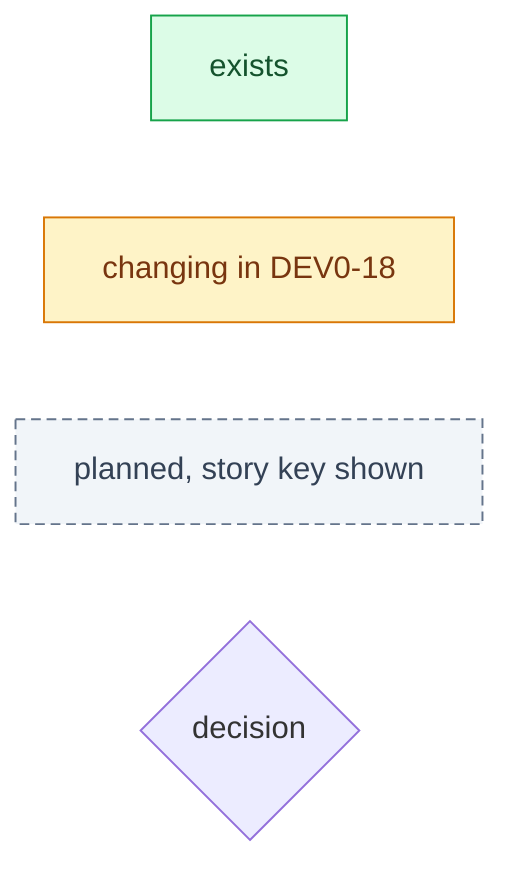
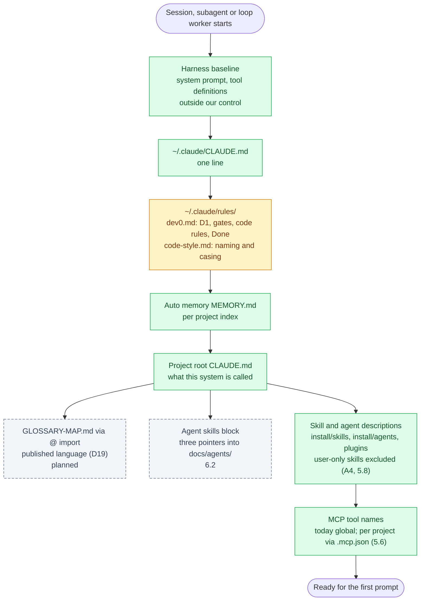
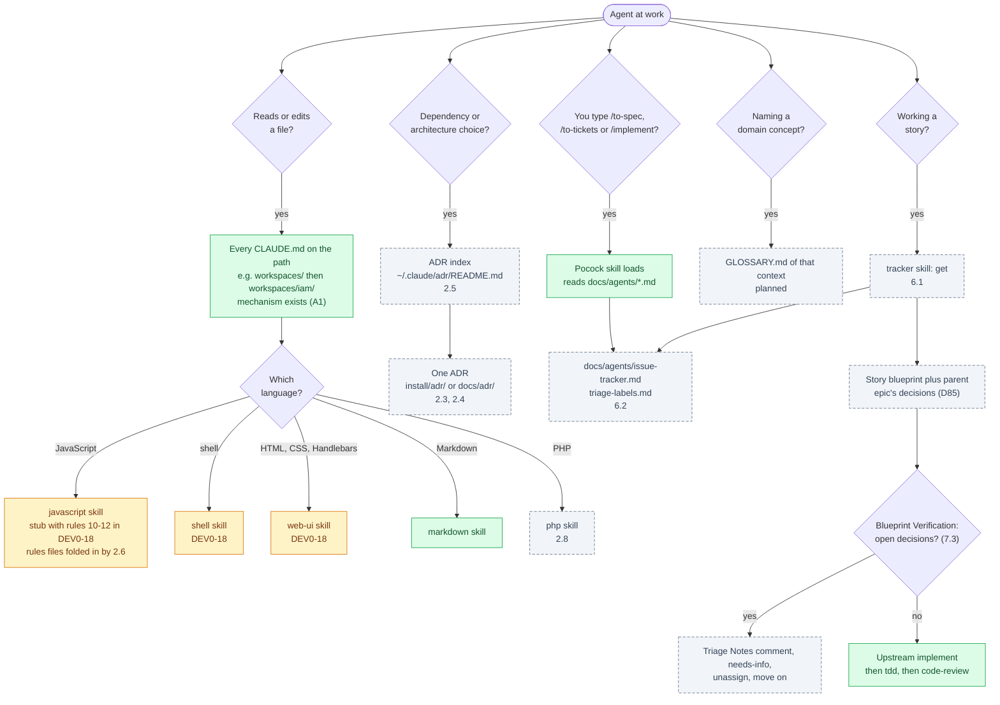
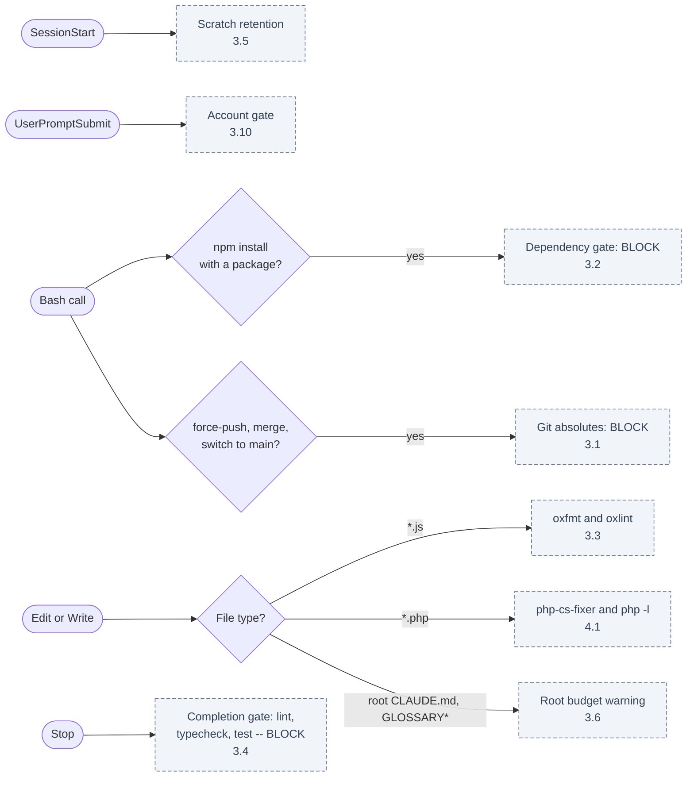

# Agent Context Map <!-- omit in toc -->

What an agent -- a session you start, a subagent, or a loop worker -- has in context, in what order it arrives, and what pulls each further file in. Each box is marked as it stands on 2026-10-04: **exists**, **changing** in DEV0-18, or **planned**, with the story that builds it. Decision IDs refer to `2026-09-11-dev0-framework.md`.

## Table of Contents <!-- omit in toc -->

- [1. Legend](#1-legend)
- [2. Always loaded, at start](#2-always-loaded-at-start)
- [3. Loaded on demand, during work](#3-loaded-on-demand-during-work)
- [4. Enforcement, not context](#4-enforcement-not-context)
- [5. Never loaded by an agent](#5-never-loaded-by-an-agent)

## 1. Legend

Everything in §2 is paid by **every** agent, including each subagent and loop worker (A2), so it is the budget that matters: D25 targets ~1,200 tokens for the global rules, D63 caps the root `CLAUDE.md` plus imports at 6 KB.

## 2. Always loaded, at start

Today `~/.claude/rules/` also carries `javascript.md`, `testing.md`, `markdown.md` and `diataxis.md` -- about 4.6k tokens in every agent. DEV0-18 rewrites `philosophy.md` as `dev0.md` (D88), without its language-specific rules; 2.6 and 2.7 demote the rest into skills.

## 3. Loaded on demand, during work

The upstream skills exist but have nothing to read yet: `docs/agents/` arrives with 6.2. Whether a loop worker can start `implement` at all is A3 (7.5).

## 4. Enforcement, not context

Hooks cost no context and cannot be talked past (D30, D32). They fire on the tool call, whichever agent made it.

None of Dev0's hooks exist yet; the only hooks running today are plugins' own (`claude-mem`).

## 5. Never loaded by an agent

- `DEV0.md` (2.2): the tenets and decision matrix, written for the architect. The single exception is the Dev0 review agent (7.4), whose job is judgement (D59).
- The framework design doc and this map: `docs/scratch/`, for you.

[← Back to Documentation Home](../README.md)
